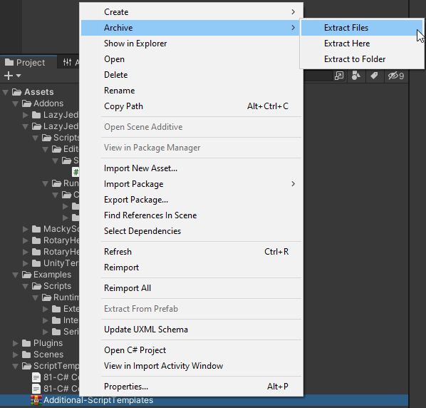

# Lazy Jedi
The Lazy Jedi is a lite Unity Library of really cool Editor Tools and Runtime scripts that will spice up any project really fast.

# Editor
## Project Setup
The Project Setup Window helps you to quickly setup any Unity Project with a few simple clicks.

To open the Project Settings Window, you can Press the following Shortcut "Shift+Alt+P" or
navigate the MenuBar Lazy-Jedi/Setup/Project Setup 

Following settings can be edited in the Project Setup Window:
* Product Icon
* Cursor Image
* Cursor Hotspot (only visible if you have a cursor image)
* Company Name
* Product Name
* Project Folders (Editable List and the Folders are only created if you click the "**Create Folders**" button)

The Company name and the Folders List is serialized to a .json file on your Machine. 
You can find that file at Application.persistentPath + /Uee/LazyJedi

The tool does come with an "Auto Save" feature that will automatically save your settings everytime you make a change to the Folders List or Company name.
However, if you are not using Auto Save, please use the **"Save Settings"** Button.

## Open
### Application Paths
### Resources Folder
## Create
### Serializable Dictionary Creator
## Unity Terminal
### Command Prompt and PowerShell
### Custom Processes

# Runtime
## Extensions
## Serializable Dictionary

# Packages
## Rotary Heart - Serializable Dictionary Lite
## MackySoft - Serializable References

# Plugins
## Adoconnection - Seven Zip Extractor
Adoconnection's Seven Zip Extractor is used to Extract Archives within Unity. It support multiple archive formats such as .zip, .rar, .7z and many others.

To use the Archive tools, you just need to right-click on an Archive, Choose Archive Selection and then choose to Extract the Archive however you wish.
* Extract Files - Extract to a folder of your choosing
* Extract Here - Extract in the Current Directory
* Extract to Folder - Extract to a Folder in the Current Directory (the folder will have the same name as the archive)

# Credits
## Assets
1. Kenney - [Fonts](https://www.kenney.nl/assets)
## Packages
1. Rotary Heart - [Serializable Dictionary Lite](https://assetstore.unity.com/publishers/28547)
2. MackySoft - [Serializable Reference Extensions](https://github.com/mackysoft/Unity-SerializeReferenceExtensions)
## Plugins
1. Adoconnection - [Seven Zip Extractor](https://github.com/adoconnection/SevenZipExtractor)
## Icons
1. FlatIcon - [Star Wars](https://www.flaticon.com/free-icons/star-wars)
