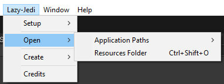

# Lazy Jedi

The Lazy Jedi is a lite Unity Library of really cool Editor Tools and Runtime scripts that will spice up any project
really fast.

# Editor

## Project Setup

The Project Setup Window helps you to quickly setup any Unity Project with a few simple clicks.

To open the Project Settings Window, you can Press the following Shortcut "Shift+Alt+P" or
navigate the MenuBar<br>Lazy-Jedi/Setup/Project Setup<br>


Following settings can be edited in the Project Setup Window:

* Product Icon
* Cursor Image
* Cursor Hotspot
    * Only visible if you have a cursor image
* Company Name
* Product Name
* Resources Folder
    * Your Local Resources Folder on your Computer,
    * You can leave it blank if you do not want to add it
* Project Folders
    * Editable List and the Folders are only created if you click the "**Create Folders**" button

The Company name, Resources Folder and the Folders List is serialized to a .json file on your Machine.<br>
You can find that file at Application.persistentPath + /Uee/LazyJedi

The tool does come with an "Auto Save" feature that will automatically save your settings everytime you make a change to
the Folders List or Company name.
However, if you are not using Auto Save, please use the **"Save Settings"** Button.


## Open

The "Open" menu in Lazy-Jedi allows you to open the Applications Persistent or Data Paths or open a Resources Folder on
your Computer.


### Resources Folder

The Resources Folder is a local folder on your machine. This is the same folder that is linked when you use the Project
Setup<br>
window and Select a local Resources folder on your Computer.



### Application Paths

The Application Paths are local folders on your machine. These folders are the Persistent and Data Paths that are
relative to your Unity Project.

The "Open/Application Paths" allows you to easily open the Directories for these Paths so that you do not have to browse
your Computer to find them.


## Create

### Serializable Dictionary Creator

Please note that the Serialize Dictionary Package is now a separate addon. However, it will be shipped with
future Lazy Jedi packages from now on.

My Serializable Dictionary Creator, you can easily create different Serializable Dictionary Implementations for
MonoBehaviours, Scriptable Objects and Serialized Dictionary Classes easily.

To use the Creator, navigate to Lazy-Jedi/Create/Serializable Dictionary


With the Creator you can easily Create Serialized Dictionary, MonoBehaviours with S-Dictionary or Scriptable Objects
with<br>
S-Dictionary Classes without much effort.


To create any one of the above classes, you need to provide the following information:

* S-Dictionary Class Name
* Class Name
* Key Type
    * Use Custom if your Type is not in the Drop Down
* Value Type
    * Use Custom if your Type is not in the Drop Down

## Unity Terminal

The Unity Terminal Addon allows you to code process commands that can be executed within Unity via the .Net
System.Diagnostics library.

This is useful if you want to execute external processes within the Unity Environment.

One good example would be to start an Android Emulator that can be used to Install and Test your Android builds made
using Unity.

### Process Utilities

The Process Utilities has static Methods that shorthand executing Processes via .Net Process method.

* StartProcess(string filename, bool runAsAdmin = false)
* StartAdvProcess(string filename, string argument, bool hideWindow = false, bool runAsAdmin = false)

Please note that you do not need to run Processes on another thread, the only reason why I am using async is to avoid
conflicts with the main Unity Thread.

```csharp
[MenuItem("Window/Python/Python Shell")]
public static async void OpenPythonShell()
{
    await Task.Run(() => ProcessUtilities.StartProcess("python", true));
}

[MenuItem("Window/Python/IDLE")]
public static async void OpenPythonIdle()
{
    await Task.Run(() => ProcessUtilities.StartAdvProcess("python", @"-m idlelib", true));
}

[MenuItem("Lazy-Jedi/Open/Resources Folder %#O", priority = 200)]
public static void OpenPersonalResourcesFolder()
{
    ProcessUtilities.StartAdvProcess("explorer.exe", ResourcesFolder);
}
```

### Command Prompt and PowerShell

Opens the Command Prompt or PowerShell in Unity as either an Admin or Non Admin.

Please Note<br>
The predefined Unity Terminal commands for opening the Command Prompt or PowerShell only work on the Windows OS.<br>
I unfortunately do no have a Linux based OS to include the equivalent commands. However, if I do get the commands I will
include them.


### Custom Processes

Custom Processes is a Script where you can create your own custom processes that can be executed within Unity.

One of the Predefined Custom Processes is to Open your Local Resources folder on your Computer. This location is set in
the Project Setup Window.

```csharp
public static class CustomProcesses
{
 #region PERSONAL

    [MenuItem("Lazy-Jedi/Open/Resources Folder %#O", priority = 200)]
    public static void OpenPersonalResourcesFolder()
    {
        ProcessUtilities.StartAdvProcess("explorer.exe", ResourcesFolder);
    }

  #endregion
}
```

# Runtime

## Extensions

For Practical examples please look at the Extension Examples in the Examples folder.
The examples will help you understand how to use the Various Extension methods that are available.

## GameObject Extensions

    * Activate(),
    * Deactivate(),
    * Destroy(),
    * Clone(),
    * GetParent(),
    * SetParent(Transform parent),
    * etc

```csharp
// GameObject Extensions
YourObject.Deactivate();
YourObject.Activate();

// Set Parent
YourObject.SetParent(YourParent);

// Get Parent
Transform parent = YourObject.GetParent();
print($"Your Objects Parent - {parent.name}");

// Get Parent GameObject
GameObject goParent = YourObject.GetParentGo();
print($"Your Objects Parent GameObject - {goParent.name}");

// Clone GameObject
GameObject clone = YourObject.Clone();
print($"Your Objects Clone - {clone.name}");

// Destroy GameObject
YourObject.Destroy();
```

## Transform Extensions

    * Activate(),
    * Deactivate(),
    * Clone(),
    * Destroy(),
    * DesroyAllChildren(),
    * SetColliderInteractionLayers(string layerMaskName)

```csharp
// Transform Extensions
// Deactivate
YourParent.Deactivate();

// Activate
YourParent.Activate();

// Clone Parent
Transform clonedParentWithChildren = ParentWithChildren.Clone();
print("Cloned Parent With Children");

// Change Layer Masks of Children that have Colliders
clonedParentWithChildren.SetColliderInteractionLayers(LayerMask.LayerToName(LayerMaskA));
print("Set Collider Interaction Layer");

// Destroy All Children
ParentWithChildren.DestroyAllChildren();
print("Delete Original Parent With Children");

```

## LayerMask Extensions

    * InLayerMask(LayerMask layerMask)

```csharp
// Check if Layer Mask A is in Layer Mask B
print($"Is Layer Mask A, in Layer Mask B - {LayerMaskB.InLayerMask(LayerMaskA)}");
```

## String Extensions

    * ToBase64(),
    * FromBase64(),
    * ToBytes(),
    * FromBytes()

```csharp
// String Conversions to Base64 and back and to Bytes and back
string word = "Hello, World!";

string word64 = word.ToBase64();
string from64 = word64.FromBase64();

byte[] wordBytes = word.ToBytes();
string fromBytes = wordBytes.FromBytes();

print($"Base64 - {word64}");
print($"From Base 64 - {from64}");

print($"Word Bytes Length - {wordBytes.Length}");
print($"From Bytes - {fromBytes}");

if (word.IsNull())
{
    print("Word is Null");
}

if (word.IsNotNull())
{
    print("Word is Not Null");
}
```

## Array and List Extensions

    * Shuffle()

```csharp
public List<string> WordsList = new List<string>()
{
    "Hello",
    "World!",
    "Simple",
    "Shuffle"
};

public string[] WordsArray = new[]
{
    "Hello",
    "World!",
    "Simple",
    "Shuffle"
};

// Shuffle Elements in an Array or List
WordsArray.Shuffle();
WordsList.Shuffle();
```

## Texture2D Extensions

    * ToBase64(),
    * ToTexture2D(),

```csharp

public Texture2D YourTexture2D;

public void Start()
{

    string base64 = YourTexture2D.ToBase64();
    print(base64);
    
    Texture2D newTexture2D = base64.ToTexure2D();
    print(newTexture2D == null);

}

```

## UI Extensions

    * AddListener(UnityAction action),
    * ToBase64(UnityAction action),
    * RemoveAllListeners(),
    * SetPlaceHolderText(string text),

```csharp
public Button YourButton;
public TMP_InputField YourInput;

public void Start()
{
    YourButton.AddListener(ButtonClickEvent);
    YourButton.RemoveListener(ButtonClickEvent);
    YourButton.RemoveAllListeners();
    
    YourInput.placeholder.SetPlaceHolderText("Hi");
}

public void ButtonClickEvent()
{
    print("Something");
}
```

## Utilities

* MathUtility - Created by BluMalice
    * GetValueFromPercentage(float percentage, float min, float max)
    * GetPercentageFromValue(float value, float min, float max)

```csharp
public class ProgressBar : MonoBehaviour
{
    public float Min;
    public float Max;
    
    public void UpdateProgress(float value)
    {
        Fill.amount = MathUtility.GetPercentageFromValue(value, Min, Max);
    }
    
    public float GetCurrentProgress()
    {
        return MathUtility.GetValueFromPercentage(Fill.amount, Min, Max);
    }
}
```

# Packages

## Rotary Heart - Serializable Dictionary Lite

Rotary Heart - Serializable Dictionary Lite is a Unity Package that adds Serializable Dictionaries to Unity.
The package comes with a Readme that explains how to setup a serializable dictionary in Unity.

Below I demonstrate the easiest way to use the Serializable Dictionary.

```csharp
[Serializable]
public class SimpleDictionary : SerializableDictionaryBase<int, string>
{
    // This is your Serialized Dictionary that will show in the Inspector
}

public class UseSerializedDictionary : MonoBehaviour
{
    [Header("Dictionary")]
    public SimpleDictionary SimpleDictionary = new SimpleDictionary();
}
```

## MackySoft - Serializable References

The "SubclassSelector" attribute allows you to easily set subclasses of those abstract classes in the Editor that are
serialized by SerializeReference
attribute.

Please look at the Serialized Reference Example in the Examples folder to understand how to use the "[SubclassSelector]"
attribute correctly.

```csharp
public interface ICommand
{
    void Execute();
}

[Serializable]
public class DebugCommand : ICommand
{
    public string Message = string.Empty;
    
    public void Execute()
    {
        Debug.Log(Message);
    }
}


[Serializable]
public class CreatorCommand : ICommand
{
    public Object Prefab;

    public void Execute()
    {
        Object.Instantiate(Prefab, new Vector3(Random.value * 5f, Random.value * 5f, 0f), Quaternion.identity);
    }
}

[AddTypeMenu("Examples/Execute Command")]
[Serializable]
public class AddTypeMenuCommand : ICommand
{
    public string Message;

    public void Execute()
    {
        Debug.Log(Message);
    }
}

public class SerializedReferenceExamples : MonoBehaviour
{
    #region VARIABLES

    [Header("Command")]
    [SerializeReference, SubclassSelector]
    public ICommand Command;

    [Header("Commands")]
    [SerializeReference, SubclassSelector]
    public List<ICommand> Commands = new List<ICommand>();

    #endregion

    #region UNITY METHODS

    private void Start()
    {
        Command?.Execute();

        foreach (ICommand command in Commands)
        {
            command?.Execute();
        }
    }
```

# Lazy Jedi Addons

+ [Lazy Seven Zip](https://github.com/Lazy-Jedi/lazy-seven-zip)
+ [Lazy Palette Swapper](https://github.com/Lazy-Jedi/lazy-palette-swapper)
+ [Lazy Sprite Extractor](https://github.com/Lazy-Jedi/lazy-sprite-extractor)

# Credits

## Creators

1. Mentor - [BluMalice](https://github.com/BLUDRAG)
2. Cristian Alexandru Geambasu - [Daemon3000](https://gist.github.com/daemon3000)

## Assets

1. Kenney - [Fonts](https://www.kenney.nl/assets)

## Packages

1. Rotary Heart - [Serializable Dictionary Lite](https://assetstore.unity.com/publishers/28547)
2. MackySoft - [Serializable Reference Extensions](https://github.com/mackysoft/Unity-SerializeReferenceExtensions)

## Plugins

1. SevenZipSharp - [SquidBox](https://github.com/squid-box/SevenZipSharp)
2. 7Zip - [7Zip](https://www.7-zip.org/)

## Icons

1. FlatIcon - [Star Wars](https://www.flaticon.com/free-icons/star-wars)
