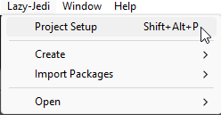
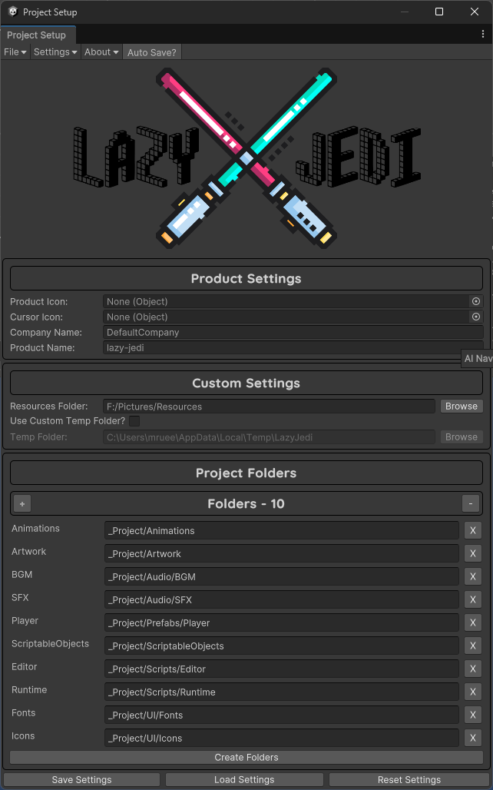
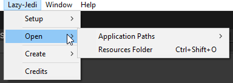
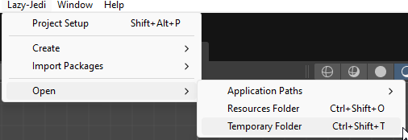
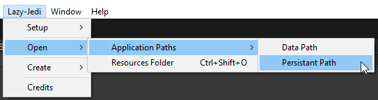
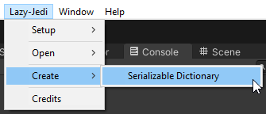
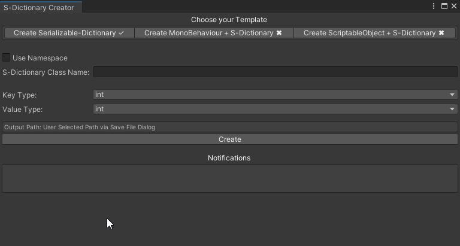
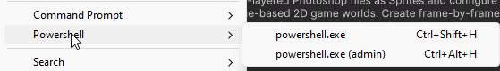

# Lazy Jedi

The Lazy Jedi is a lite Unity Library of really cool Editor Tools and Runtime scripts that will spice up any project
really fast.

# Editor

## Project Setup

The Project Setup Window helps you to quickly setup any Unity Project with a few simple clicks.

To open the Project Settings Window, you can Press the following Shortcut "Shift+Alt+P" or
navigate the MenuBar<br>Lazy-Jedi/Setup/Project Setup<br>



Following settings can be edited in the Project Setup Window:

* Product Icon
* Cursor Image
* Cursor Hotspot
    * Only visible if you have a cursor image
* Company Name
* Product Name
* Resources Folder
    * Your Local Resources Folder on your Computer,
    * You can leave it blank if you do not want to add it
* Project Folders
    * Editable List and the Folders are only created if you click the "**Create Folders**" button

The Company name, Resources Folder and the Folders List is serialized to a .json file on your Machine.<br>
You can find that file at Application.persistentPath + /Uee/LazyJedi

The tool does come with an "Auto Save" feature that will automatically save your settings everytime you make a change to
the Folders List or Company name.
However, if you are not using Auto Save, please use the **"Save Settings"** Button.



## Open

The "Open" menu in Lazy-Jedi allows you to open the Applications Persistent or Data Paths or open a Resources Folder on
your Computer.



### Resource and Temporary Folders

The Resources Folder is a local folder on your machine. This is the same folder that is linked when you use the Project
Setup window and Select a local Resources folder on your Computer.

The Temporary Folder is a local folder on your machine that is used to save temporary files that are created by
Serializing Scriptable Objects for example.<br>
You can use the Temporary Folder to save any temporary files that you may need to use in your project.



### Application Paths

The Application Paths are local folders on your machine. These folders are the Persistent and Data Paths that are
relative to your Unity Project.

The "Open/Application Paths" allows you to easily open the Directories for these Paths so that you do not have to browse
your Computer to find them.



## Create

### Serializable Dictionary Creator

Please note that the Serialize Dictionary Package is now a separate addon. However, it will be shipped with
future Lazy Jedi packages from now on.

My Serializable Dictionary Creator, you can easily create different Serializable Dictionary Implementations for
MonoBehaviours, Scriptable Objects and Serialized Dictionary Classes easily.

To use the Creator, navigate to Lazy-Jedi/Create/Serializable Dictionary



With the Creator you can easily Create Serialized Dictionary, MonoBehaviours with S-Dictionary or Scriptable Objects
with<br>
S-Dictionary Classes without much effort.



To create any one of the above classes, you need to provide the following information:

* S-Dictionary Class Name
* Class Name
* Key Type
    * Use Custom if your Type is not in the Drop Down
* Value Type
    * Use Custom if your Type is not in the Drop Down

## Unity Terminal

The Unity Terminal Addon allows you to code process commands that can be executed within Unity via the .Net
System.Diagnostics library.

This is useful if you want to execute external processes within the Unity Environment.

One good example would be to start an Android Emulator that can be used to Install and Test your Android builds made
using Unity.

### Process Utilities

The Process Utilities has static Methods that shorthand executing Processes via .Net Process method.

* StartProcess(string filename, bool runAsAdmin = false)
* StartAdvProcess(string filename, string argument, bool hideWindow = false, bool runAsAdmin = false)

Please note that you do not need to run Processes on another thread, the only reason why I am using async is to avoid
conflicts with the main Unity Thread.

```csharp
[MenuItem("Window/Python/Python Shell")]
public static async void OpenPythonShell()
{
    await Task.Run(() => ProcessUtilities.StartProcess("python", true));
}

[MenuItem("Window/Python/IDLE")]
public static async void OpenPythonIdle()
{
    await Task.Run(() => ProcessUtilities.StartAdvProcess("python", @"-m idlelib", true));
}

[MenuItem("Lazy-Jedi/Open/Resources Folder %#O", priority = 200)]
public static void OpenPersonalResourcesFolder()
{
    ProcessUtilities.StartAdvProcess("explorer.exe", ResourcesFolder);
}
```

### Command Prompt and PowerShell

Opens the Command Prompt or PowerShell in Unity as either an Admin or Non Admin.

Please Note<br>
The predefined Unity Terminal commands for opening the Command Prompt or PowerShell only work on the Windows OS.<br>
I unfortunately do no have a Linux based OS to include the equivalent commands. However, if I do get the commands I will
include them.



### Custom Processes

Custom Processes is a Script where you can create your own custom processes that can be executed within Unity.

One of the Predefined Custom Processes is to Open your Local Resources folder on your Computer. This location is set in
the Project Setup Window.

```csharp
public static class CustomProcesses
{
 #region PERSONAL

    [MenuItem("Lazy-Jedi/Open/Resources Folder %#O", priority = 200)]
    public static void OpenPersonalResourcesFolder()
    {
        ProcessUtilities.StartAdvProcess("explorer.exe", ResourcesFolder);
    }

  #endregion
}
```

# Runtime

## IO

### DataIO

DataIO is a static class that allows you to easily save and load data to and from a file.
You can use this class to save and load Serializable Classes, Structs or ScriptableObjects.

The following method Parameters are optional:

+ slotIndex - Default Slot is 1
+ filename - Default filename is "typeof(T).Name"
+ pathType - Default pathType is PathType.DefaultFolder
+ prettyPrint - Default prettyPrint is false

The following strings can be changed at runtime to suit your needs.

```csharp
// Default PathType is PersistentDataPath
string defaultPath = DataIO.DefaultPath;

// Default Save Path is Application.persistentDataPath + "/Saves/"
string savePath = DataIO.SavePath;

// Default Settings Path is Application.persistentDataPath + "/Settings/"
string settingsPath = DataIO.SettingsPath;

// Default Slot Prefix is "Slot_"
string slotPrefix = DataIO.SlotPrefix;

// Default File Extension is "json"
string extension = DataIO.Extension;

```

The following methods can be used to save and load data:

```csharp
// Save Data
DataIO.Save(data, filename: "filename", pathType: PathType.DefaultFolder, prettyPrint: true);

// Save Data to Slot
DataIO.SaveToSlot(data, slotIndex: 1, filename:"filename", pathType: PathType.DefaultFolder, prettyPrint: true);

// Load Data
DataIO.Load<T>(filename: "filename", pathType: PathType.DefaultFolder); // T is the Type of the Data you want to load

// Load Data from Slot
DataIO.LoadFromSlot<T>(slotIndex: 1, filename: "filename", pathType: PathType.DefaultFolder); // T is the Type of the Data you want to load

// Load and Overwrite Data
DataIO.LoadAndOverwrite(data, filename: "filename", pathType: PathType.DefaultFolder);

// Load and Overwrite Data from Slot
DataIO.LoadAndOverwriteFromSlot(slotIndex: 1, filename: "filename", pathType: PathType.DefaultFolder);

// Delete Data
DataIO.Delete<T>(filename: "filename", pathType: PathType.DefaultFolder); // T is the Type of the Data you want to delete

// Delete Data from Slot
DataIO.Delete<T>(slotIndex: 1, filename: "filename", pathType: PathType.DefaultFolder); // T is the Type of the Data you want to delete
```

### SecureDataIO

DataIO is a static class that allows you to easily save and load data to and from a file.
You can use this class to save and load Serializable Classes, Structs or ScriptableObjects.

Please note that you can encrypt and decrypt data using the SecureDataIO class. However, you will need to set the Key
and IV before you can encrypt and decrypt data using the AES save and load methods.

**!!! Important !!!** <br>
You are responsible for keeping your AES Key and IV safe. If you lose your AES Key or IV you will not
be able to decrypt your data.

The following method Parameters are optional:

+ slotIndex - Default Slot is 1
+ filename - Default filename is "typeof(T).Name"
+ pathType - Default pathType is PathType.DefaultFolder
+ prettyPrint - Default prettyPrint is false

The following strings can be changed at runtime to suit your needs.

```csharp
// Default PathType is PersistentDataPath
string defaultPath = SecureDataIO.DefaultPath;

// Default Save Path is Application.persistentDataPath + "/Saves/"
string savePath = SecureDataIO.SavePath;

// Default Settings Path is Application.persistentDataPath + "/Settings/"
string settingsPath = SecureDataIO.SettingsPath;

// Default Slot Prefix is "Slot_"
string slotPrefix = SecureDataIO.SlotPrefix;

// Default File Extension is "bin"
string extension = SecureDataIO.Extension;

// The Default CipherMode is CBC
CipherMode CipherMode = SecureDataIO.CipherMode;

// The Default PaddingMode is PKCS7
PaddingMode PaddingMode =SecureDataIO.PaddingMode;
```

The following methods can be used to generate a new AES Key and IV and RSA Public and Private Keys:
```csharp
GenerateRSAKeyPair(out RSAParameters publicKey, out RSAParameters privateKey);
GenerateAESKeyAndIV(out byte[] aesKey, out byte[] aesIV);
EncryptAESKey(RSAParameters publicKey, byte[] aesKey, bool fOAEP = false);
```

The following methods are used to save and load data using either Base64 or AES encryption and decryption. <br>
```csharp
// Save Data - Base64
SecureDataIO.Save(data, filename: "filename", pathType: PathType.DefaultFolder, prettyPrint: true);

// Save Data to Slot - Base64
SecureDataIO.SaveToSlot(data, slotIndex: 1, filename:"filename", pathType: PathType.DefaultFolder, prettyPrint: true);

// Load Data - Base64
SecureDataIO.Load<T>(filename: "filename", pathType: PathType.DefaultFolder); // T is the Type of the Data you want to load

// Load Data from Slot - Base64
SecureDataIO.LoadFromSlot<T>(slotIndex: 1, filename: "filename", pathType: PathType.DefaultFolder); // T is the Type of the Data you want to load

// Load and Overwrite Data - Base64
SecureDataIO.LoadAndOverwrite(data, filename: "filename", pathType: PathType.DefaultFolder);

// Load and Overwrite Data from Slot - Base64
SecureDataIO.LoadAndOverwriteFromSlot(slotIndex: 1, filename: "filename", pathType: PathType.DefaultFolder);

// Save Data - AES
SecureDataIO.Save(data, key, iv, filename: "filename", pathType: PathType.DefaultFolder, prettyPrint: true);

// Save Data to Slot - AES
SecureDataIO.SaveToSlot(data, key, iv, slotIndex: 1, filename:"filename", pathType: PathType.DefaultFolder, prettyPrint: true);

// Load Data - AES
SecureDataIO.Load<T>(key, iv, filename: "filename", pathType: PathType.DefaultFolder); // T is the Type of the Data you want to load

// Load Data from Slot - AES
SecureDataIO.LoadFromSlot<T>(key, iv, slotIndex: 1, filename: "filename", pathType: PathType.DefaultFolder); // T is the Type of the Data you want to load

// Load and Overwrite Data - AES
SecureDataIO.LoadAndOverwrite(data, key, iv, filename: "filename", pathType: PathType.DefaultFolder);

// Load and Overwrite Data from Slot - AES
SecureDataIO.LoadAndOverwriteFromSlot(data, key, iv, slotIndex: 1, filename: "filename", pathType: PathType.DefaultFolder);

// Delete Data
SecureDataIO.Delete<T>(filename: "filename", pathType: PathType.DefaultFolder); // T is the Type of the Data you want to delete

// Delete Data from Slot
SecureDataIO.DeleteFromSlot<T>(slotIndex: 1, filname: "filename", pathType: PathType.DefaultFolder); // T is the Type of the Data you want to delete
```

## Extensions

For Practical examples please look at the Extension Examples in the Examples folder.
The examples will help you understand how to use the Various Extension methods that are available.

### Object Extensions

    * IsNull(),
    * IsNotNull(),
    * ToJson(),
    * Save(),
    * Load(),
    * Overwrite(),

```csharp
MyScriptableObject myScriptableObject;

myScriptableObject.IsNull(); // Returns true if the Object is null
myScriptableObject.IsNotNull(); // Returns true if the Object is not null

myScriptableObject.ToJson(); // Returns the ScriptableObject as a Json String

// Save ScriptableObject to a Json File
myScriptableObject.Save(); // Saves the ScriptableObject to a Json File

// Saves the ScriptableObject to a Json File with the name "MyScriptableObject" and pretty prints the Json
myScriptableObject.Save(filename:"MyScriptableObject", pathType:PathType.Default, prettyPrint: true);

// Saves the ScriptableObject to a Json File with the name "MyScriptableObject" to the first save slot and pretty prints the Json
myScriptableObject.Save(slotIndex:1, filename:"MyScriptableObject", pathType:PathType.Default, prettyPrint: true);

// Overwrite myScriptableObject
myScriptableObject.Overwrite(); // Loads the ScriptableObject data and Overwrites the myScriptableObject

// Overwrite myScriptableObject with the data from the Json File with the name "MyScriptableObject"
myScriptableObject.Overwrite(filename:"MyScriptableObject",pathType:PathType.Default);

// Overwrite myScriptableObject with the data from the first save slot
myScriptableObject.Overwrite(slotIndex:1,filename:"MyScriptableObject",pathType:PathType.Default);
```

### GameObject Extensions

    * Activate(),
    * Deactivate(),
    * Destroy(),
    * Clone(),
    * GetParent(),
    * SetParent(Transform parent),
    * etc

```csharp
// GameObject Extensions
YourObject.Deactivate();
YourObject.Activate();

// Set Parent
YourObject.SetParent(YourParent);

// Get Parent
Transform parent = YourObject.GetParent();
print($"Your Objects Parent - {parent.name}");

// Get Parent GameObject
GameObject goParent = YourObject.GetParentGo();
print($"Your Objects Parent GameObject - {goParent.name}");

// Clone GameObject
GameObject clone = YourObject.Clone();
print($"Your Objects Clone - {clone.name}");

// Destroy GameObject
YourObject.Destroy();
```

### Transform Extensions

    * Activate(),
    * Deactivate(),
    * Clone(),
    * Destroy(),
    * DesroyAllChildren(),
    * SetColliderInteractionLayers(string layerMaskName)

```csharp
// Transform Extensions
// Deactivate
YourParent.Deactivate();

// Activate
YourParent.Activate();

// Clone Parent
Transform clonedParentWithChildren = ParentWithChildren.Clone();
print("Cloned Parent With Children");

// Change Layer Masks of Children that have Colliders
clonedParentWithChildren.SetColliderInteractionLayers(LayerMask.LayerToName(LayerMaskA));
print("Set Collider Interaction Layer");

// Destroy All Children
ParentWithChildren.DestroyAllChildren();
print("Delete Original Parent With Children");

```

### LayerMask Extensions

    * InLayerMask(LayerMask layerMask)

```csharp
// Check if Layer Mask A is in Layer Mask B
print($"Is Layer Mask A, in Layer Mask B - {LayerMaskB.InLayerMask(LayerMaskA)}");
```

### String Extensions

    * IsNullOrEmpty(), IsNullOrWhiteSpace()
    * FromJson(), FromJsonOverwrite()
    * ToBase64(), FromBase64(),
    * ToBytes(), FromBytes()
    * ToShort(), ToInt(), ToFloat(), ToDouble(), ToLong(), ToBool() 
    * IsValidEmail_Regex(), IsValidEmail_StrictRegex(), IsValidEmail_MailAddress()
    * IsValidUrl_Regex(), IsValidUrl_Uri()
    * IsValidPhoneNumber(), IsAlphanumeric(), InnerTrim()
    * HasSpecialChars(), RemoveAllSpecialChars(), RemoveSpecialChars_ExclSpaces(), RemoveSpecialChars_ExclPunctuation()

```csharp
// String Conversions to Base64 and back and to Bytes and back
string word = "Hello, World!";

string word64 = word.ToBase64();
string from64 = word64.FromBase64();

byte[] wordBytes = word.ToBytes();
string fromBytes = wordBytes.FromBytes();

print($"Base64 - {word64}");
print($"From Base 64 - {from64}");

print($"Word Bytes Length - {wordBytes.Length}");
print($"From Bytes - {fromBytes}");

if (word.IsNull())
{
    print("Word is Null");
}

if (word.IsNotNull())
{
    print("Word is Not Null");
}

// Parsing a String Int, Float, Double, etc to its Primitive Type
string aStringInt = "1";
int anInt = aStringInt.ToInt();

string aStringFloat = "3.14";
float aFloat = aStringFloat.ToFloat();

string aStringDouble = "3.145";
double aDouble = aStringDouble.ToDouble();

string emailAddress = "your.email.address-123@domain1.com";
string specialCharactersSequence = "A!@#$%^&*()_+=-`~[]B{}\\|;:\'\",<.>/?C";
string wordsWithSpecialChars = "Hello, %^#$World!";
string sentence = "Hello, World!\nLet's go!\nTime for a \"Programming\" Lesson!\nEmail me @ youremail@gmail.com for*any#questions (what language to use).";
string alphaNumeric = "123ABC";
string url = "https://www.google.com";
string mobileNumber = "+27821234567";

print($"Is Valid Email {emailAddress} : {emailAddress.IsValidEmail_MailAddress()}");
print($"Is Valid Email {emailAddress} : {emailAddress.IsValidEmail_Regex()}");
print($"Is Valid Email {emailAddress} : {emailAddress.IsValidEmail_StrictRegex()}");

print($"Is AlphaNumeric {alphaNumeric} - {alphaNumeric.IsAlphanumeric()}");

print($"Has Special Characters {specialCharactersSequence} - {specialCharactersSequence.HasSpecialChars()}");
print($"Remove All Special Characters {specialCharactersSequence} - {specialCharactersSequence.RemoveAllSpecialChars()}");
print($"Remove Special Chars Excl Spaces {wordsWithSpecialChars} - {wordsWithSpecialChars.RemoveSpecialChars_ExclSpaces()}");
print($"Remove Special Chars Excl Punctuation {sentence} - {sentence.RemoveSpecialChars_ExclPunctuation(" ")}");

print($"Is Valid Number {mobileNumber} - {mobileNumber.IsValidPhoneNumber()}");
print($"Is Valid URL {url} - {url.IsValidUrl_Regex()}");
print($"Is Valid URL {url} - {url.IsValidUrl_Uri()}");

```

### Float Extensions

Convert a float to a Time String either a mm:ss (minutes and seconds) or hh:mm:ss (hours, minutes and seconds)

    * ToTimeMS(),
    * ToTimeHMS(),

```csharp

float time = 1800.14f;

// This will print out the time equivalent of the float in Minutes and Seconds
print(time.ToTimeMS());

// This will print out the time equivalent of the float in Hours,Minutes and Seconds
print(time.ToTimeHMS());

```

### Array and List Extensions

    * Shuffle(),
    * GetRandomItem(),
    * Swap()

```csharp
public List<string> WordsList = new List<string>()
{
    "Hello",
    "World!",
    "Simple",
    "Shuffle"
};

public string[] WordsArray = new[]
{
    "Hello",
    "World!",
    "Simple",
    "Shuffle"
};

private void Start()
{
    // Shuffle Elements in an Array or List
    WordsArray.Shuffle();
    WordsList.Shuffle();
    
    WordsArray.Swap(i, j);
    WordsList.Swap(i, j);
    
    string item1 = WordsArray.GetRandomItem();
    string item2 = WordsList.GetRandomItem();

}
```

### Texture2D Extensions

    * ToBase64(),
    * ToTexture2D(),

```csharp

public Texture2D YourTexture2D;

public void Start()
{

    string base64 = YourTexture2D.ToBase64();
    print(base64);
    
    Texture2D newTexture2D = base64.ToTexure2D();
    print(newTexture2D == null);

}

```

### UI Extensions

    * AddListener(UnityAction action),
    * ToBase64(UnityAction action),
    * RemoveAllListeners(),
    * SetPlaceHolderText(string text),

```csharp
public Button YourButton;
public TMP_InputField YourInput;

public void Start()
{
    YourButton.AddListener(ButtonClickEvent);
    YourButton.RemoveListener(ButtonClickEvent);
    YourButton.RemoveAllListeners();
    
    YourInput.placeholder.SetPlaceHolderText("Hi");
}

public void ButtonClickEvent()
{
    print("Something");
}
```

## Utilities

### MathUtility - Created by BluMalice

+ GetValueFromPercentage(float percentage, float min, float max)
+ GetPercentageFromValue(float value, float min, float max)

```csharp
public class ProgressBar : MonoBehaviour
{
    public float Min;
    public float Max;
    
    public void UpdateProgress(float value)
    {
        Fill.amount = MathUtility.GetPercentageFromValue(value, Min, Max);
    }
    
    public float GetCurrentProgress()
    {
        return MathUtility.GetValueFromPercentage(Fill.amount, Min, Max);
    }
}
```

### SecurityUtility

You can use the SecurityUtility to encrypt and decrypt data using AES and RSA Encryption. <br>
AES can be used on large data sets and RSA can be used to encrypt the AES Key and IV.

The methods below are used to generate cryptographically secure random byte array or AES and RSA Keys.
```csharp
GenerateUniqueByteArray(int length = 16)
GenerateAESKeyAndIV(out byte[] key, out byte[] iv)
GenerateRSAKeyPair(out RSAParameters publicKey, out RSAParameters privateKey, int keySize = 2048)
```

The methods below are used to encrypt and decrypt data using AES and RSA.

```csharp
AESEncryption(string data, ref byte[] key, ref byte[] iv, CipherMode cipherMode = CipherMode.CBC, PaddingMode paddingMode = PaddingMode.PKCS7)
AESDecryption(byte[] data, ref byte[] key, ref byte[] iv, CipherMode cipherMode = CipherMode.CBC, PaddingMode paddingMode = PaddingMode.PKCS7)
RSAEncryption(byte[] data, RSAParameters publicKey, bool fOAEP = false)
RSADecryption(byte[] data, RSAParameters privateKey, bool fOAEP = false)
```

The methods below are used to import and export RSA Keys and store them in the Registry or PlayerPrefs.

```csharp
ImportRSAXMLKeys(string publicKey, string privateKey)
ExportRSAXMLKeys(RSAParameters publicKey, RSAParameters privateKey)
StoreRSAKey_Registry(string key, string value, string rsaKey)
StoreRSAKey_PlayerPrefs(string key, string value)
GetRSAKey_Registry(string keyID)
GetRSAKey_PlayerPrefs(string keyID)
DeleteRSAKey_Registry(string keyID)
DeleteRSAKey_PlayerPrefs(string keyID)
```

# Packages

## Rotary Heart - Serializable Dictionary Lite

Rotary Heart - Serializable Dictionary Lite is a Unity Package that adds Serializable Dictionaries to Unity.
The package comes with a Readme that explains how to setup a serializable dictionary in Unity.

Below I demonstrate the easiest way to use the Serializable Dictionary.

```csharp
[Serializable]
public class SimpleDictionary : SerializableDictionaryBase<int, string>
{
    // This is your Serialized Dictionary that will show in the Inspector
}

public class UseSerializedDictionary : MonoBehaviour
{
    [Header("Dictionary")]
    public SimpleDictionary SimpleDictionary = new SimpleDictionary();
}
```

## MackySoft - Serializable References

The "SubclassSelector" attribute allows you to easily set subclasses of those abstract classes in the Editor that are
serialized by SerializeReference
attribute.

Please look at the Serialized Reference Example in the Examples folder to understand how to use the "[SubclassSelector]"
attribute correctly.

```csharp
public interface ICommand
{
    void Execute();
}

[Serializable]
public class DebugCommand : ICommand
{
    public string Message = string.Empty;
    
    public void Execute()
    {
        Debug.Log(Message);
    }
}


[Serializable]
public class CreatorCommand : ICommand
{
    public Object Prefab;

    public void Execute()
    {
        Object.Instantiate(Prefab, new Vector3(Random.value * 5f, Random.value * 5f, 0f), Quaternion.identity);
    }
}

[AddTypeMenu("Examples/Execute Command")]
[Serializable]
public class AddTypeMenuCommand : ICommand
{
    public string Message;

    public void Execute()
    {
        Debug.Log(Message);
    }
}

public class SerializedReferenceExamples : MonoBehaviour
{
    #region VARIABLES

    [Header("Command")]
    [SerializeReference, SubclassSelector]
    public ICommand Command;

    [Header("Commands")]
    [SerializeReference, SubclassSelector]
    public List<ICommand> Commands = new List<ICommand>();

    #endregion

    #region UNITY METHODS

    private void Start()
    {
        Command?.Execute();

        foreach (ICommand command in Commands)
        {
            command?.Execute();
        }
    }
```

# Lazy Jedi Addons

+ [Lazy Seven Zip](https://github.com/Lazy-Jedi/lazy-seven-zip)
+ [Lazy Palette Swapper](https://github.com/Lazy-Jedi/lazy-palette-swapper)
+ [Lazy Sprite Extractor](https://github.com/Lazy-Jedi/lazy-sprite-extractor)

# Credits

## Creators

1. Mentor - [BluMalice](https://github.com/BLUDRAG)
2. Cristian Alexandru Geambasu - [Daemon3000](https://gist.github.com/daemon3000)

## Assets

1. Kenney - [Fonts](https://www.kenney.nl/assets)
2. Omnibus-Type - MuseoModerno - [Font](https://fonts.google.com/specimen/MuseoModerno?query=Museo)
3. Andrew Paglinawan - Quicksand - [Font](https://fonts.google.com/specimen/Quicksand?query=quicksand)
4. Hubert and Fischer - Rubik - [Font](https://fonts.google.com/specimen/Rubik?query=rubik)

## Packages

1. Rotary Heart - [Serializable Dictionary Lite](https://assetstore.unity.com/publishers/28547)
2. MackySoft - [Serializable Reference Extensions](https://github.com/mackysoft/Unity-SerializeReferenceExtensions)

## Plugins

1. SevenZipSharp - [SquidBox](https://github.com/squid-box/SevenZipSharp)
2. 7Zip - [7Zip](https://www.7-zip.org/)

## Icons

1. FlatIcon - [Star Wars](https://www.flaticon.com/free-icons/star-wars)
